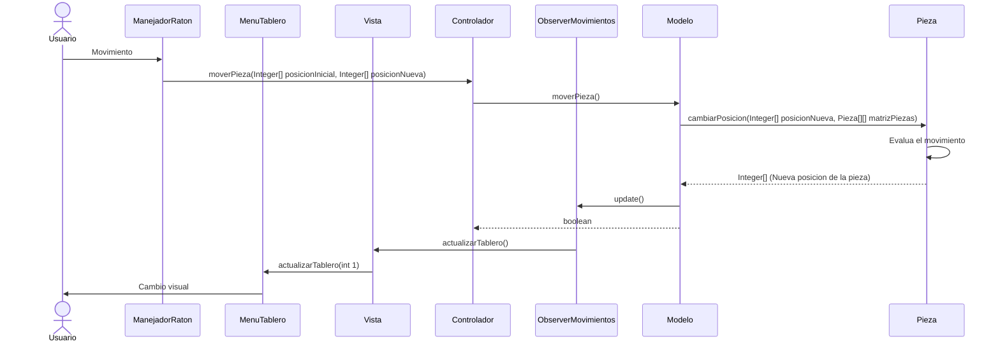
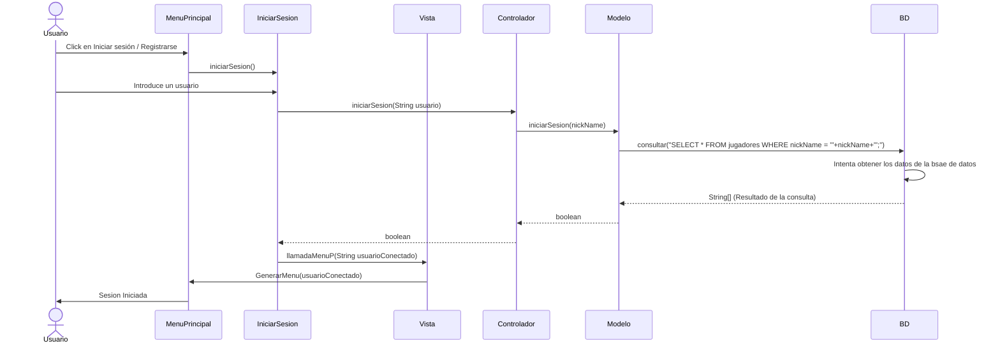

# AJEDREZ
Con el objetivo de unificar las competencias obtenidas a lo largo del curso relativas
a la Programación Orientada a Objetos con Java, bases de datos con MySQL e
Interfaz Gráfica con awt/Swing. Realizamos una aplicación que permite jugar ajedrez con usuario.
# DIAGRAMA DE CLASES

```mermaid
classDiagram
    class Controlador{
    +modelo : Modelo
    +vista : Vista
    +osbserverMovimientos : ObserverMovimientos
    +main(args : String[])
    +iniciarSersion(nickName : String) : boolean
    +registrarUsuario(nickName : String) : boolean
    +usuarioConectado(nickName : String) : String[]
    +iniciarPartida() : Pieza[][]
    +terminarPartida()
    +posicionesAcutales() : Pieza[][]
    +moverPieza(posicionInicial :Integer[], posicionNueva : Integer[])
    +cambiarTurno()
    +turnoAutomata()
    +guardarPartida()
    +cargarPartida()
    +actualizarTablero()
    }
        
    class ObserverMovimientos{
    +update(o : Observable, arg : Object)
    }
    
    class Observer{
    }
    
    class Observable{
    }
    
    class Modelo{
    +bd : BD
    +jugador : Jugador
    +turno : Integer
    +partida : Partida
    +guardado : Guardado
    +automata : Automata
    +movimiento : Movimiento
    +peonB1 : Pieza
    +peonB2 : Pieza
    +peonB3 : Pieza
    +peonB4 : Pieza
    +peonB5 : Pieza
    +peonB6 : Pieza
    +peonB7 : Pieza
    +peonB8 : Pieza
    +torreB1 : Pieza
    +torreB2 : Pieza
    +caballoB1 : Pieza
    +caballoB2 : Pieza
    +alfilB1 : Pieza
    +alfilB2 : Pieza
    +reinaB : Pieza
    +reyB : Pieza
    +peonN1 : Pieza
    +peonN2 : Pieza
    +peonN3 : Pieza
    +peonN4 : Pieza
    +peonN5 : Pieza
    +peonN6 : Pieza
    +peonN7 : Pieza
    +peonN8 : Pieza
    +torreN1 : Pieza
    +torreN2 : Pieza
    +caballoN1 : Pieza
    +caballoN2 : Pieza
    +alfilN1 : Pieza
    +alfilN2 : Pieza
    +reinaN : Pieza
    +reyN : Pieza
    +matrizPiezas : Pieza[][]
    +posicionesIniciales() : Pieza[][]
    +terminarPartida() : boolean
    +crearPiezas()
    +asignarMatriz() : Pieza[][]
    +obtenerMatriz() : Pieza[][]
    +destruirPiezas() : boolean
    +destruirMatriz() : boolean
    +moverPieza(posicionInicial : Integer[], posicionNueva : Integer[]) : boolean
    +cambiarTurno()
    +turnoMaquina()
    +iniciarSesion(nickName : String) : boolean
    +registrarUsuario(nickName : String) : boolean
    +obtenerDatos() : String[]
    +modificarEstadisticas(modificacion : int)
    +turnoMaquina()
    +cargarPartida()
    }
    
    class IPieza{
    +BLANCO = 0 : Integer
    +NEGRO = 1 : Integer
    +cambiarPosicion(posicionNueva : Intger[], matrizPiezas Pieza[][]) : Integer[]
    }
    
    class Pieza{
    -nombre : String
    -posicion : Integer[]
    -nMovimientos : int
    -color : Integer
    +cambiarPosicion(posicionNueva : Integer[], matrizPiezas : Pieza[][]) : Integer[]
    }
    
    class Peon{
    +cambiarPosicion(posicionNueva : Integer[], matrizPiezas : Pieza[][]) : Integer[]
    }
    
    class Torre{
    +cambiarPosicion(posicionNueva : Integer[], matrizPiezas : Pieza[][]) : Integer[]
    }
    
    class Caballo{
    +cambiarPosicion(posicionNueva : Integer[], matrizPiezas : Pieza[][]) : Integer[]
    }
    
    class Alfil{
    +cambiarPosicion(posicionNueva : Integer[], matrizPiezas : Pieza[][]) : Integer[]
    }
    
    class Reina{
    +cambiarPosicion(posicionNueva : Integer[], matrizPiezas : Pieza[][]) : Integer[]
    }
    
    class Rey{
    +cambiarPosicion(posicionNueva : Integer[], matrizPiezas : Pieza[][]) : Integer[]
    }
    
    class BD{
    +bs : String
    +tabla : String
    +conexion : Connection
    +url : String
    +user : String
    +password : String
    +consulta : Statement
    +seleccion : Statement
    +conectar()
    +modificar(textoModificacion : String) : boolean
    +consultar(textoConsulta : String) : String[]
    +registrar(textoModificacion : String) : boolean
    +cerrar()
    }
    
    class Jugador{
    -nickName : String
    -partidasJugadas : String
    -victorias : String
    -derrotas : String
    -tablas : String
    +obtenerDatos()
    }
    
    class Partida{
    +nickName : String
    +estadorPartida : Pieza[][]
    +turno : Integer
    +ajustarTipos()
    }
    
    class Automata{
    -EstadoTablero : Pieza[][]
    -profundidad : int = 3
    -puntuacion : int = 0
    +alfa : int = Integer.MIN_VALUE
    +beta : int = Integer.MAX_VALUE
    +EvaluarTablero(TableroActual : Pieza[][]) : int
    +Minimax(profundidad : int, TableroActual : Pieza[][], alfa : int, beta : int, esMaximizador : boolean) : int
    +copiarTablero(TableroActual : Pieza[][]) : Pieza[][]
    +EvaluarPiezas(Tablero : Pieza [][]) : int
    +EvaluarPosicionesCentrales(Tablero : Pieza[][]) : int
    +DefensaRey(Tablero : Pieza[][]) : int
    +EstructuraPeones(Tablero Pieza[][]) : int
    +esJaqueMaquina(Tablero : Pieza[][]) : boolean
    +esJaqueMateMaquina(Tablero Pieza[][]) : boolean
    }
    
    class Movimiento{
    +filaDestino : int
    +columnaDestino : int
    +filaOrigen : int
    +columnaOrigen : int
    +PuedeComer : boolean
    +MovimientoPieza(Tablero : Pieza[][], fila : int, columna : int) : List<Movimiento>
    +MovimientosCompletos(Tablero : Pieza[][]) : List<Movimiento>
    +realizarMovimiento(Tablero : Pieza[][], movimiento : Movimiento) : Pieza[][]
    +MovimientoFinal(Tablero : Pieza[][], movimiento : Movimiento) : Pieza[][]
    +esJaqueJugador(Tablero : Pieza[][]) : boolean
    +JaqueMateJugador(Tablero : Pieza[][], jaque : boolean) : boolean
    }
    
    class Vista{
    +llamadaMenuP(usuarioConectado : String)
    +actualizarTablero()
    +terminarPartida()
    }
    
    class MenuPrincipal{
    +GenerarMenu(usuarioConectado : String)
    }
    
    class MenuTablero{
    +etiquetaTemporizador : JLabel
    +tablero : JPanel
    +partida : JFrame
    +label : JLabel[][]
    +GenerarMenu(modo : int)
    +GenerarTablero(modo : int)
    +temporizador(minutos : int)
    +modificarVisual(segundos : int)
    +actualizarTablero(modo : int)
    +terminarPartida()
    }
    
    class IniciarSesion{
    +iniciarSesion()
    }
    
    class Estadisticas{
    +estadisticas()
    }
    
    class ManejadorRaton{
    +posicionInicial : Integer[]
    +posicionNueva : Integer[]
    +label : JLabel[][]
    +celdaActual : JLabel
    +mouseClicked(e : MouseEvent)
    +mousePressed(e : MouseEvent)
    +mouseEntered(e : MouseEvent)
    +mouseReleased(e : MouseEvent)
    +mouseExited(e : MouseEvent)
    }
    
    class MouseListener{
    +estadisticas()
    }
    
    
    Controlador o-- Modelo : aggregation
    Modelo --|> Observable : Inheritance
    Controlador o-- ObserverMovimientos : aggregation
    ObserverMovimientos *-- Observer : implements
    Controlador o-- Vista : aggregation
    Vista o-- MenuPrincipal : aggregation
    MenuPrincipal o-- MenuTablero : aggregation
    MenuPrincipal o-- IniciarSesion : aggregation
    MenuPrincipal o-- Estadisticas : aggregation
    MenuTablero o-- ManejadorRaton : aggregation
    ManejadorRaton *-- MouseListener : implements
    Pieza *-- IPieza : implements
    Peon --|> Pieza : Inheritance
    Torre --|> Pieza : Inheritance
    Caballo --|> Pieza : Inheritance
    Alfil --|> Pieza : Inheritance
    Reina --|> Pieza : Inheritance
    Rey --|> Pieza : Inheritance    
    Modelo o-- Peon : aggregation
    Modelo o-- Torre : aggregation
    Modelo o-- Caballo : aggregation
    Modelo o-- Alfil : aggregation
    Modelo o-- Reina : aggregation
    Modelo o-- Rey : aggregation
    Modelo o-- BD : aggregation
    Modelo o-- Jugador : aggregation
    Modelo o-- Partida : aggregation
    Modelo o-- Automata : aggregation
    Modelo o-- Movimiento : aggregation
```

# DIAGRAMA DE SECUENCIA (Movimiento de piezas)

# DIAGRAMA DE SECUENCIA (Inicio de sesión)

